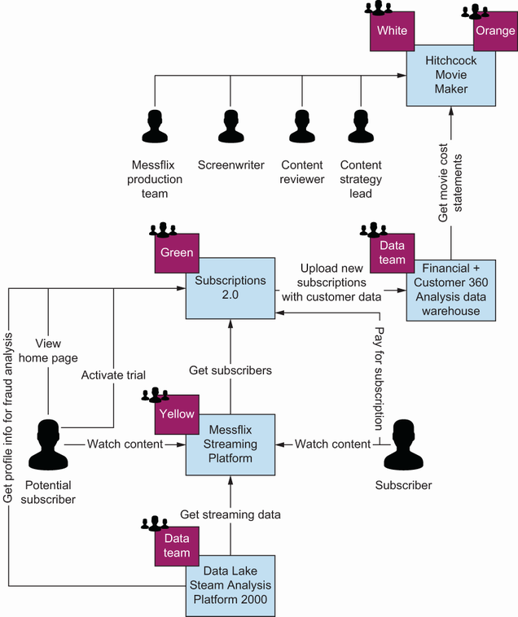

# Messflix (hypothetical)

Messflix, a movie- and TV-show streaming platform, just hit a wall. A *data* wall. The company has all the data in the world but complains about not even being able to build a proper recommendation system for its movies and shows. The competition seems to be able to get it done; in fact, the competition is famous for being the first movers in a lot of technology sectors.

Other companies in equally complex industries seem to be able to put their data to work. Messflix does work with data, and analysts are able to get some insights from it, but the organization's leaders don't feel like they can call themselves *data driven*.

The data science trial runs seem to all end in "pretty prototypes" with no clear business value. The data scientists tell their managers that it's because the "product team just doesn't want to put these great prototypes on the roadmap," or, in another instance, "because the data from the source is way too messy and inconsistent."

In short, Messflix hopefully sounds like your average business, which for some reason doesn't feel like it's able to *let the right data flow to the right use cases*. The data landscape, just like the technology landscape, has grown organically over time and has become quite complex.

The two key technology components of Messflix are its Messflix Streaming Platform and Hitchcock Movie Maker. The streaming platform does just what it says: enable subscribers to watch shows and movies. The movie maker is a set of tools helping the movie production teams choose good movie topics, themes, and content.

Additionally, Messflix has a data lake with an analytics platform on top of it taking data from everywhere. A few teams manage these components. The teams Orange and White together operate a few of the Hitchcock Movie Maker tools. Team Green is all about the subscriptions, the log-in processes, etc., and team Yellow is responsible for getting things on the screen inside the streaming platform. Figure below depicts a rough architecture sketch of a few of these components before we briefly discuss how data is currently handled at Messflix.

The Data team gets data into the data warehouse from a few different places---for example, cost statements from the Hitchcock Movie Maker and subscriptions from the subscriptions service. The team also gets streaming data and subscription profiles from the data lake. Then the Data team does some number crunching to transform this data into information for fraud analysis and business decisions. Finally, this information is used by decentralized units to make those business decisions and for other use cases. This currently is a centralized workflow. The data team "sits in the middle."

No matter where you're coming from and where you want to go, you will find yourself somewhere along the Messflix journey. So let's take one final look at the complete journey Messflix is going through. No data journey is a simple straight line. Likewise, we don't pretend that the Messflix journey is a simple linear progression of a series of steps.