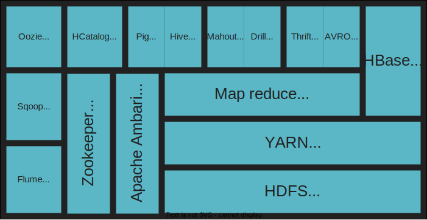

# Hadoop Basics

Apache Hadoop is an open source framework that is used to efficiently store and process large datasets ranging in size from gigabytes to petabytes of data. Instead of using one large computer to store and process the data, Hadoop allows clustering multiple computers to analyze massive datasets in parallel more quickly.

Hadoop consists of four main modules:

1. Hadoop Distributed File System (HDFS) – A distributed file system that runs on standard or low-end hardware. HDFS provides better data throughput than traditional file systems, in addition to high fault tolerance and native support of large datasets.
2. Yet Another Resource Negotiator (YARN) – Manages and monitors cluster nodes and resource usage. It schedules jobs and tasks.
3. MapReduce – A framework that helps programs do the parallel computation on data. The map task takes input data and converts it into a dataset that can be computed in key value pairs. The output of the map task is consumed by reduce tasks to aggregate output and provide the desired result.
4. Hadoop Common – Provides common Java libraries that can be used across all modules.

<YouTube vid="aReuLtY0YMI" title="Hadoop In 5 Minutes | What Is Hadoop? | Introduction To Hadoop | Hadoop Explained |Simplilearn" />

Hadoop makes it easier to use all the storage and processing capacity in cluster servers, and to execute distributed processes against huge amounts of data. Hadoop provides the building blocks on which other services and applications can be built.

Applications that collect data in various formats can place data into the Hadoop cluster by using an API operation to connect to the NameNode. The NameNode tracks the file directory structure and placement of “chunks” for each file, replicated across DataNodes. To run a job to query the data, provide a MapReduce job made up of many map and reduce tasks that run against the data in HDFS spread across the DataNodes. Map tasks run on each node against the input files supplied, and reducers run to aggregate and organize the final output.

The Hadoop ecosystem has grown significantly over the years due to its extensibility. Today, the Hadoop ecosystem includes many tools and applications to help collect, store, process, analyze, and manage big data. Some of the most popular applications are:

- Spark – An open source, distributed processing system commonly used for big data workloads. Apache Spark uses in-memory caching and optimized execution for fast performance, and it supports general batch processing, streaming analytics, machine learning, graph databases, and ad hoc queries.
- Presto – An open source, distributed SQL query engine optimized for low-latency, ad-hoc analysis of data. It supports the ANSI SQL standard, including complex queries, aggregations, joins, and window functions. Presto can process data from multiple data sources including the Hadoop Distributed File System (HDFS) and Amazon S3.
- Hive – Allows users to leverage Hadoop MapReduce using a SQL interface, enabling analytics at a massive scale, in addition to distributed and fault-tolerant data warehousing.
- HBase – An open source, non-relational, versioned database that runs on top of Amazon S3 (using EMRFS) or the Hadoop Distributed File System (HDFS). HBase is a massively scalable, distributed big data store built for random, strictly consistent, real-time access for tables with billions of rows and millions of columns.
- Zeppelin – An interactive notebook that enables interactive data exploration.

## Hadoop Architecture

<YouTube vid="ohroxsisQ0w" title="The Hadoop ecosystem" />

Let's take a quick look at the simplified Hadoop components in this figure, where the starting point is the servers:

Hadoop has one too many working servers or, in Hadoop terms, **worker nodes**. The worker nodes are simply computers with a filesystem where you can store files. HDFS sits on top of these multiple filesystems; when you store data in HDFS, Hadoop seamlessly distributes the files to these filesystems. You can create a table structure on top of the files using Hive, so SQL users can access the data using the SQL language. The other option is to process it using distributed processing frameworks such as Spark or MapReduce. These frameworks can read and write directly to HDFS.  

There are tools that are usually used to ingest data to HDFS, for example, Flume, Kafka, and Sqoop. The above figure is just a very simplified summary of the Hadoop ecosystem; in the marketplace, there are a lot of other alternatives for each component. If this is the first time you have learned about Hadoop, don't fall into a trap where you think you need to understand all of the products and their alternatives. Instead, focus on understanding how HDFS works and how Spark or MapReduce can process data in HDFS. The other components will come naturally with time when you understand HDFS and the processing framework.

## Hadoop on Amazon EMR

> Amazon EMR is a managed service that lets you process and analyze large datasets using the latest versions of big data processing frameworks such as Apache Hadoop, Spark, HBase, and Presto on fully customizable clusters.

Elastic MapReduce, or EMR, is Amazon Web Services’ solution for managing prepackaged Hadoop clusters and running jobs on them. You can work with regular MapReduce jobs or Apache Spark jobs, and can use Apache Hive, Apache Pig, Apache HBase, and some third-party applications. Scripting hooks enable the installation of additional services. Data is typically stored in Amazon S3 or Amazon DynamoDB.

The normal mode of operation for EMR is to define the parameters for a cluster, such as its size, location, Hadoop version, and variety of services, point to where data should be read from and written to, and define steps to execute such as MapReduce or Spark jobs. EMR launches a cluster, performs the steps to generate the output data, and then tears the cluster down. However, you can leave clusters running for further use, and even resize them for greater capacity or a smaller footprint.

EMR provides an API so that you can automate the launching and management of Hadoop clusters.

Follow [this](https://aws.amazon.com/emr/features/hadoop/) blog for more information.