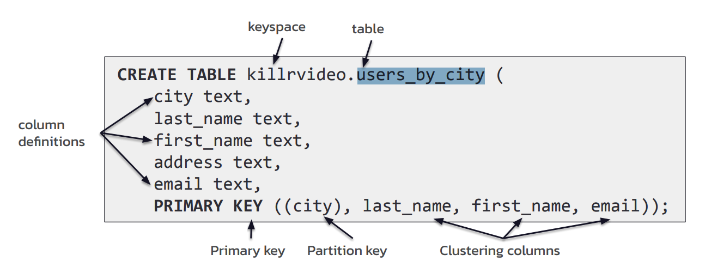

## Objective

NoSQL data modeling and analysis with Apache Cassandra

## Starting Cassandra

### Run server

`cassandra -f`

### Activate CQL shell

Run `cqlsh`

## CQL - Cassandra CLI

We will learn the basics of Cassandra Query Language (CQL). We will first install the CLI and then connect to the Cassandra server. Then we will start creating keyspaces and tables and load data into those tables. Finally, we will apply CRUD operations and understand key concepts like primary key and partition key.

### Create a keyspace

A keyspace is a namespace for a set of tables sharing a data replication strategy and some options. It is conceptually similar to a "database" in a relational database management system.

Create the keyspace:

```sql
CREATE KEYSPACE killr_video
WITH replication = {
  'class': 'SimpleStrategy', 
  'replication_factor': 1 }; 
```

Our keyspace name is killr_video. Any data in this keyspace will be replicated using replication strategy SimpleStrategy and replication factor 1 . In production, however, we strongly recommend multiple datacenters and at least three replicas per datacenter for higher availability.

### Set a working keyspace

Many CQL statements work with tables, indexes and other objects defined within a specific keyspace. For example, to refer to a table, we have to either use a fully-qualified name consisting of a keyspace name and a table name, or set a working keyspace and simply refer to the table by its name. For convenience, we go with the second option.

Set the current working keyspace:

```sql
USE killr_video;
```

### Create a table

A Cassandra table has named columns with data types, rows with values, and a primary key to uniquely identify each row. As an example, let's create table users with four columns and primary key email .

Create the table:

```sql
CREATE TABLE users (
  email TEXT PRIMARY KEY,
  name TEXT,
  age INT,
  date_joined DATE
);
```

Example:



### Insert a row

Add the row into our table using the CQL INSERT statement:

```sql
INSERT INTO users (email, name, age, date_joined) 
VALUES ('joe@datastax.com', 'Joe', 25, '2020-01-01');
```

Insert another row into the table:

```sql
INSERT INTO users (email, name, age, date_joined) 
VALUES ('jen@datastax.com', 'Jen', 27, '2020-01-01');
```

### Retrieve a row

Now, retrieve the row using the CQL SELECT statement:

```sql
SELECT * FROM users
WHERE email = 'joe@datastax.com';
```

Retrieve a different row from the table:

```sql
SELECT * FROM users
WHERE email = 'jen@datastax.com';
```

### Update a row

Next, update the row using the CQL UPDATE statement:

```sql
UPDATE users SET name = 'Joseph' 
WHERE email = 'joe@datastax.com';

SELECT * FROM users;
```

Update another row in the table:

```sql
UPDATE users SET name = 'Jennifer' 
WHERE email = 'jen@datastax.com';

SELECT * FROM users;
```

### Delete a row

Finally, delete the row using the CQL DELETE statement:

```sql
DELETE FROM users 
WHERE email = 'joe@datastax.com';

SELECT * FROM users;
```

Delete another row from the table:

```sql
DELETE FROM users 
WHERE email = 'jen@datastax.com';

SELECT * FROM users;
```

## Test Your Understanding

Here is a short quiz for you.

Q1. Which CQL statement can be used to add rows into a table?

- [ ] A. SELECT
- [ ] B. DELETE
- [ ] C. INSERT

<details>
    <summary>Show me the Answer! </summary>
    C
</details>
<br/>

Q2. Which CQL statement can be used to retrieve rows from a table?

- [ ] A. SELECT
- [ ] B. DELETE
- [ ] C. INSERT

<details>
    <summary>Show me the Answer! </summary>
    A
</details>
<br/>

Q3. Which CQL statement can be used to remove rows from a table?

- [ ] A. SELECT
- [ ] B. DELETE
- [ ] C. INSERT

<details>
    <summary>Show me the Answer! </summary>
    B
</details>
<br/>


## Cassandra with Python

We will perform the same activities as we did in CLI lab but instead of CLI, we will use Python API.

## Solution

```
.
├── [8.4K]  1_keyspaces&table.ipynb
├── [3.8K]  1_keyspaces_tables.py
├── [7.6K]  2_keyspaces&table.ipynb
├── [2.4K]  2_queries.py
├── [2.7K]  3_clustering_key.py
├── [8.3K]  3_keyspaces&table.ipynb
├── [3.0K]  4_where_clause.py
├── [ 23K]  _cassandra-cli.mdx
├── [ 46K]  cassandra-beginners
│   ├── [2.0K]  01-sa-cassandra-python.ipynb
│   ├── [6.3K]  02-sa-create-table-in-cassandra.ipynb
│   ├── [ 12K]  03-sa-three-queries-three-tables.ipynb
│   ├── [9.9K]  04-sa-primary-key.ipynb
│   ├── [7.3K]  05-sa-clustering-column.ipynb
│   └── [8.7K]  06-sa-using-the-where-clause.ipynb
├── [3.5K]  cqlsh_intro.cql
├── [119K]  killrvideo.png
├── [3.9K]  lab-28-cassandra-getting-started.md
├── [4.6K]  learning_cql_data_types.cql
└── [  49]  requirements.txt

 237K used in 1 directory, 19 files
```